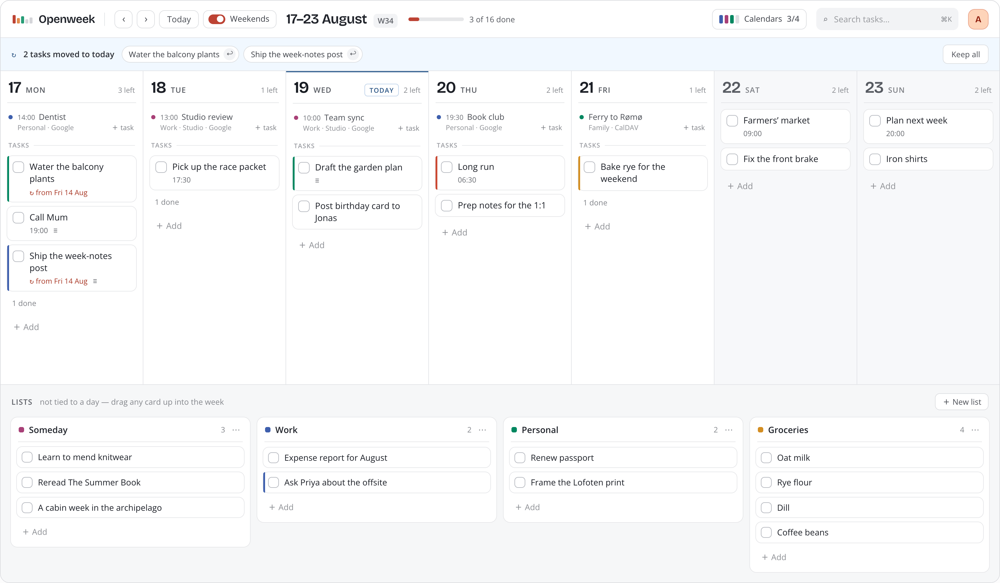
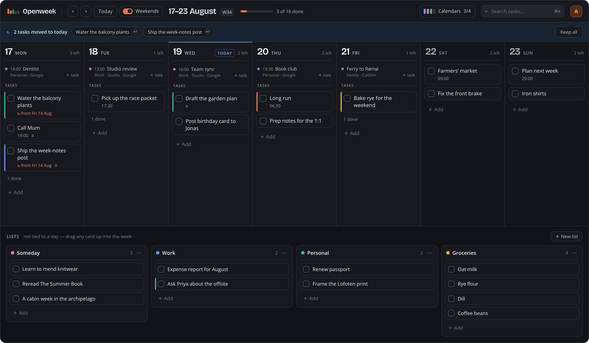
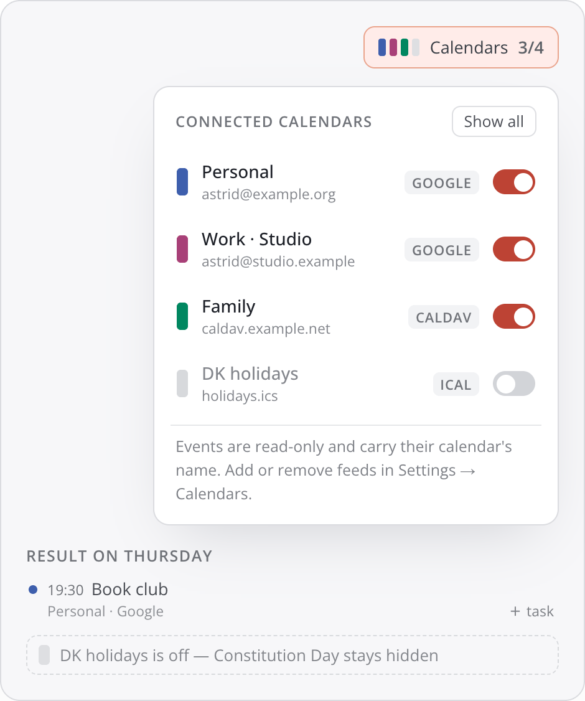
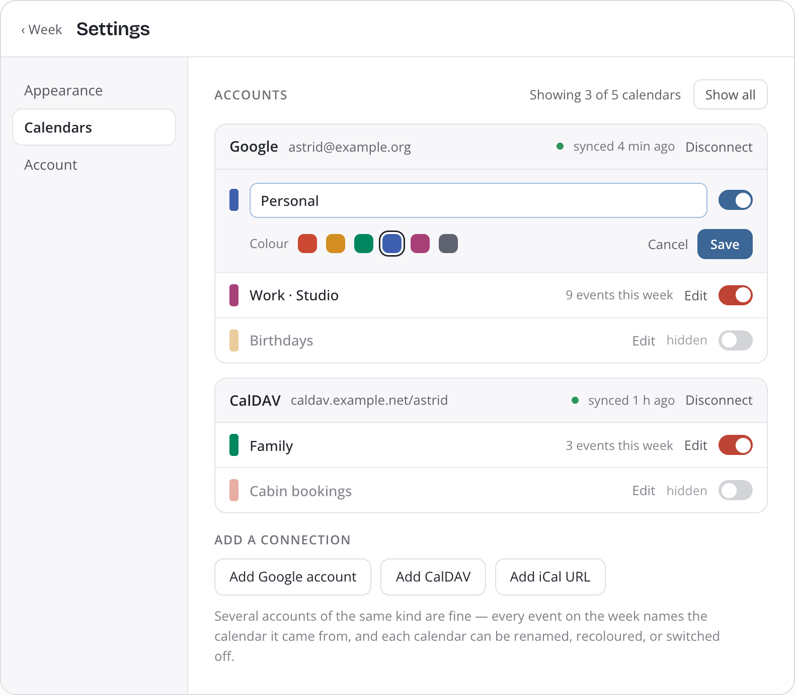
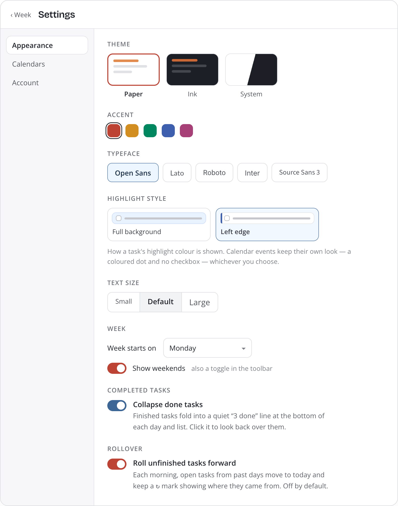
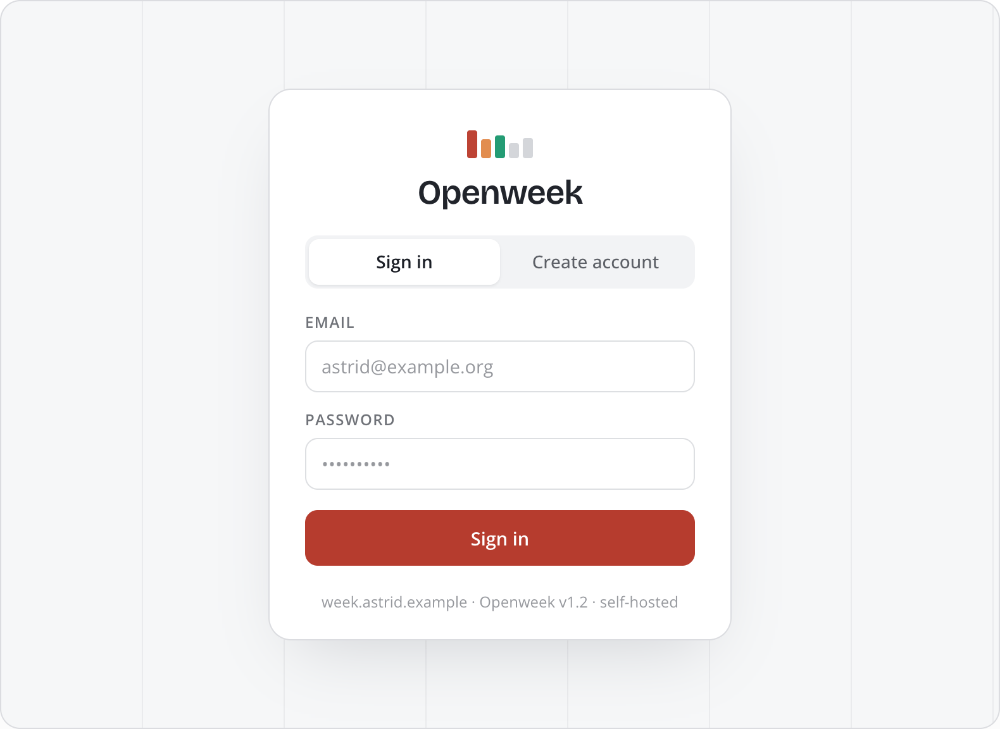

<div align="center">

# 🗓️ Openweek

**A free, open-source, self-hostable weekly planner.**

A calm, paper-planner week grid for your tasks — drag them around, check them off, ink-tag them.
An open alternative to [tweek.so](https://tweek.so), [teuxdeux.com](https://teuxdeux.com), and
[weektodo.me](https://weektodo.me), built to self-host.

[](./LICENSE)


<br>



</div>

---

## Summary

Openweek is a **minimalist weekly to-do app**. The whole interface is a **week grid**: seven day columns plus a
rail of "Someday" lists, where each task is a bullet you can drag between days, tick off, tag with a
highlighter ink, and annotate. There's **no hourly scheduling** — the week itself is the canvas. It's designed
to feel quiet and structural, not a SaaS dashboard: a cool neutral ramp, one accent, hairline rules, generous
whitespace. Ships as Paper (light) and Ink (dark).

It's **AGPL-3.0** and **self-host first** — your tasks live in your own Postgres, in your own container.

## Features

- 🗒️ **Week grid** — 7 day columns + a rail of lists; previous / next / this-week navigation, focus-a-day,
  collapse-done, and a weekends toggle.
- ✅ **Tasks** — create, edit, complete, ink-tag, time, and annotate.
- 🔀 **Drag & drop** — reorder within a day or list and move tasks across both; every drag is paired with a
  keyboard "Move to…" path.
- ↪️ **Auto-rollover** *(opt-in)* — unfinished past tasks roll forward to today, with a review banner to send
  them back.
- 📅 **Calendar sync** *(read-only)* — mirror **Google Calendar, CalDAV** (Apple/Nextcloud/Fastmail), and
  **iCal feeds** into your week. Connect multiple accounts, show/hide and recolour each calendar; tokens are
  encrypted at rest.
- 🔐 **Accounts** — email/password + optional Google sign-in. The **first user to register becomes the admin**.
- 🎨 **Paper / Ink** — light and dark, a selectable accent, typeface and text size.
- 🐳 **Self-hostable** — one `docker compose up`, or a Portainer stack, or a Proxmox LXC/VM.

> Not yet: subtasks, recurring tasks, reminders, two-way calendar sync, and offline/PWA — these are
> [planned for later](./docs/roadmap.md). The data model already leaves room for them.

## Screenshots

### The same week in Ink



Paper and Ink are one design in two palettes — identical layout and behaviour, every colour re-tuned rather
than inverted. Pick either, or follow your OS.

### Calendars, one switch each



Google, CalDAV and iCal feeds side by side in the toolbar. Turn one off and its events leave the week
immediately — no reload, no refetch.

### Settings → Calendars



Rename, recolour or hide any calendar, see what each one contributes to the week you're looking at, and
connect more accounts. Sync is **read-only** — nothing is ever written back to your calendar.

### Settings → Appearance



Paper, Ink or System; an accent, a typeface and a text size; plus the week-start, weekends, collapse-done and
rollover switches.

### Sign in



Email and password out of the box, with optional Google sign-in. The first account registered on a fresh
instance becomes its admin.

## Tech stack

[Nuxt 4](https://nuxt.com) · TypeScript · [PostgreSQL](https://www.postgresql.org) +
[Drizzle ORM](https://orm.drizzle.team) · [Zod](https://zod.dev) · [Tailwind CSS v4](https://tailwindcss.com) +
[DaisyUI](https://daisyui.com) · [Better Auth](https://better-auth.com) ·
[Pragmatic drag-and-drop](https://github.com/atlassian/pragmatic-drag-and-drop) · Docker.
Full list and rationale: [docs/tech-stack.md](./docs/tech-stack.md).

---

# Self-hosting

Openweek ships as a single Nuxt app plus Postgres. There is **no prebuilt image yet** — the compose stack
builds from source, so every route below starts from a clone of this repository.

**Before you start**, generate two secrets and keep them somewhere safe:

```bash
openssl rand -base64 32   # BETTER_AUTH_SECRET
openssl rand -base64 32   # OPENWEEK_ENCRYPTION_KEY  ← back this up (see "Backups")
```

Pick your route:

| Route | Good for | Guide |
|---|---|---|
| **Docker Compose** | A box you already have SSH on. The reference path. | [below](#docker-compose) |
| **Portainer** | Managing it from a web UI alongside your other stacks. | [below](#portainer) |
| **Proxmox** | A dedicated LXC or VM on your homelab hypervisor. | [below](#proxmox) |

Reverse proxy, TLS, backups, and every environment variable: **[docs/self-hosting.md](./docs/self-hosting.md)**.

## Docker Compose

Requires Docker Engine + the Compose plugin.

```bash
git clone https://github.com/silo/openweek.git
cd openweek

cp .env.example .env
# Edit .env — at minimum BETTER_AUTH_SECRET, OPENWEEK_ENCRYPTION_KEY and BETTER_AUTH_URL.
# BETTER_AUTH_URL must be the URL you will actually open in a browser, e.g.
#   http://192.168.1.50:3000   or   https://openweek.example.com

docker compose up -d --build
```

Open the URL you set. **The first account you register becomes the admin.**

The first build takes several minutes (it runs a full Nuxt production build). Migrations are applied
automatically by the container entrypoint on every start, so there is no separate migrate step.

```bash
docker compose logs -f app          # follow the app
docker compose down                 # stop (the openweek-db volume keeps your data)
git pull && docker compose up -d --build   # update
```

**Harden it before exposing it.** The defaults are tuned for a laptop:

- Set `POSTGRES_PASSWORD` in `.env` **before the first `up`**. Postgres only reads it when it initialises the
  data directory; changing it later needs an `ALTER USER` inside the running container.
- The database port is published on `127.0.0.1` only, so it is reachable from the host but not the network.
  If you don't need `psql` from the host, delete the `ports:` block from the `db` service — the app talks to
  it over the compose network either way.
- Put it behind a reverse proxy with TLS and set `BETTER_AUTH_URL` to the public HTTPS URL. Sessions and
  OAuth redirects are derived from it, so a mismatch shows up as login loops.
  See [docs/self-hosting.md](./docs/self-hosting.md#reverse-proxy).

## Portainer

Portainer builds the image itself from a Git-backed stack, so you never touch a shell.

1. **Stacks → Add stack**, name it `openweek`, choose **Repository**.
2. **Repository URL** `https://github.com/silo/openweek` · **Reference** `refs/heads/main` ·
   **Compose path** `docker-compose.yml`.
   For a private fork, tick *Authentication* and use a personal access token.
3. Under **Environment variables**, add:

   | Name | Value |
   |---|---|
   | `BETTER_AUTH_SECRET` | your first generated secret |
   | `OPENWEEK_ENCRYPTION_KEY` | your second generated secret |
   | `BETTER_AUTH_URL` | the URL you'll browse to, e.g. `https://openweek.example.com` |
   | `POSTGRES_PASSWORD` | a strong password (set it now — see the note above) |
   | `OPENWEEK_PORT` | host port, if `3000` is taken |

   Compose fails fast and loudly if the two secrets are missing, so a typo here shows up immediately in the
   deployment log rather than as a broken app.
4. **Deploy the stack.** The first deployment builds the image — expect several minutes with no output; watch
   *Containers → openweek-app-1 → Logs* for `→ Applying database migrations…` then `→ Starting Openweek`.

To update: **Stacks → openweek → Pull and redeploy**, with *Re-pull image* enabled so the build re-runs.

Portainer's stack editor keeps your environment variables, so they survive redeploys. They are stored in
Portainer's own database in plaintext — treat that database as sensitive, or hand the secrets in through a
`.env` on the host instead.

## Proxmox

Proxmox doesn't run OCI containers itself; you give it a guest that runs Docker. Two options.

### A VM (recommended)

The path Proxmox itself recommends for Docker — full kernel isolation, no nesting caveats, and snapshots that
actually capture the whole thing.

1. Create a VM from a Debian 12 or Ubuntu Server 24.04 cloud image. **2 vCPU / 2 GB RAM / 20 GB disk** is a
   comfortable starting point.
2. Install Docker: `curl -fsSL https://get.docker.com | sh`
3. Follow [Docker Compose](#docker-compose) above.
4. Snapshot the VM once it's up, before you put real data in it.

### An LXC container (lighter)

Uses noticeably less RAM and disk, at the cost of some setup friction. Docker inside an **unprivileged** LXC
needs two features enabled — without them the daemon starts but containers fail with cryptic overlayfs or
keyring errors.

1. Create a Debian 12 container, **unprivileged**, 2 vCPU / 2 GB RAM / 20 GB disk.
2. On the Proxmox host, enable nesting and keyctl for it (replace `110` with your CTID):

   ```bash
   pct set 110 --features nesting=1,keyctl=1
   pct reboot 110
   ```

   Or in the web UI: **Container → Options → Features → Nesting + keyctl**.
3. Inside the container: `apt update && apt install -y curl && curl -fsSL https://get.docker.com | sh`
4. Follow [Docker Compose](#docker-compose) above.

> If you use ZFS as the container's storage backend, set Docker's storage driver to `overlay2` on an ext4
> subvolume, or Docker will fall back to `vfs` and images will be enormous and slow.

### Either way

- Give the guest a **static IP or DHCP reservation** — `BETTER_AUTH_URL` is baked into the stack's config, so
  a changing address means logging in stops working.
- Back up the guest with Proxmox Backup Server *and* take Postgres dumps
  ([docs/self-hosting.md](./docs/self-hosting.md#backups)). A filesystem snapshot of a running database is not
  a guaranteed-consistent backup.

## Configuration

Set these in `.env` (or as stack environment variables). The app **validates its config at boot** and fails
fast with a clear message if something is missing or malformed.

| Variable | Required | Purpose |
|---|---|---|
| `DATABASE_URL` | ✅ | Postgres connection string. Compose sets this for the app automatically. |
| `BETTER_AUTH_SECRET` | ✅ | Signs sessions. |
| `BETTER_AUTH_URL` | ✅ | Your public URL, e.g. `https://openweek.example.com`. |
| `OPENWEEK_ENCRYPTION_KEY` | ✅ | Base64 of exactly 32 bytes — encrypts calendar tokens at rest. **Back it up.** |
| `POSTGRES_PASSWORD` | recommended | Bundled Postgres password. Defaults to `openweek`; set before first start. |
| `OPENWEEK_PORT` | optional | Host port for the app (default `3000`). |
| `GOOGLE_CLIENT_ID` / `GOOGLE_CLIENT_SECRET` | optional | Google sign-in and/or Google Calendar sync. |
| `OPENWEEK_SYNC_INTERVAL` | optional | Calendar poll interval (default `15m`). |
| `OPENWEEK_EVENT_WINDOW` | optional | Event cache window (default `-1w..+6w`). |

---

## Local development

For working on Openweek itself. Requires Node 22+, [pnpm](https://pnpm.io), and Docker for the database.

```bash
cp .env.example .env
pnpm install

pnpm db:up       # start just the Postgres container, wait until healthy
pnpm db:migrate  # apply the schema
pnpm db:seed     # optional: a demo account + a week of test data
pnpm dev         # http://localhost:3000
```

`docker compose` reads the same `.env` as the app, so if you change `OPENWEEK_DB_PORT` (handy when several
checkouts run side by side) keep the port in `DATABASE_URL` in sync.

Other scripts:

```bash
pnpm typecheck     # vue-tsc strict type-check — blocking gate, the build does not type-check
pnpm lint          # ESLint
pnpm test          # Vitest (see docs/testing.md)
pnpm test:coverage # Vitest with a coverage report
pnpm db:stop       # stop the database (the openweek-db volume keeps your data)
pnpm db:reset      # destroy the volume, recreate the database, re-migrate
pnpm db:psql       # psql shell inside the container
pnpm db:logs       # tail Postgres logs
pnpm db:generate   # generate a migration after editing the schema
pnpm auth:gen      # regenerate Better Auth tables after auth config changes
pnpm build         # production build
```

Before any PR: `pnpm lint && pnpm typecheck && pnpm test` must be green.

## Documentation

| Doc | What's in it |
|---|---|
| [docs/README.md](./docs/README.md) | Documentation index. |
| [docs/tech-stack.md](./docs/tech-stack.md) | Dependencies, versions, and what we rejected and why. |
| [docs/architecture.md](./docs/architecture.md) | Folders, layers, data flow, state model. |
| [docs/data-model.md](./docs/data-model.md) | Database schema and constraints. |
| [docs/calendar-sync.md](./docs/calendar-sync.md) | How calendar connections and sync work. |
| [docs/design.md](./docs/design.md) | Paper/Ink, tokens, accessibility, responsive layout. |
| [docs/self-hosting.md](./docs/self-hosting.md) | Operations: env, Docker, reverse proxy, backups. |
| [docs/testing.md](./docs/testing.md) | Test strategy and the seeded fixtures. |
| [docs/roadmap.md](./docs/roadmap.md) | Build phases and scope. |
| [docs/decisions.md](./docs/decisions.md) | Why key choices were made. |

## Contributing

Contributions are welcome. Openweek is in early development, so the most useful help right now is feedback on
the [plan](./docs/roadmap.md) and [decisions](./docs/decisions.md). Before opening a PR, please run
`pnpm lint && pnpm typecheck && pnpm test`. (A `CONTRIBUTING.md` will follow with the first release.)

## License

[AGPL-3.0](./LICENSE). You can self-host and modify Openweek freely; if you run a modified version as a network
service, the AGPL requires you to offer your users the modified source. This is deliberate — so hosted forks
stay open.
